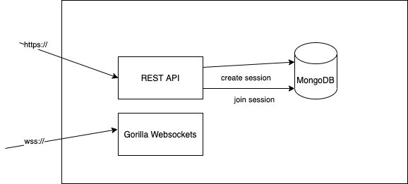
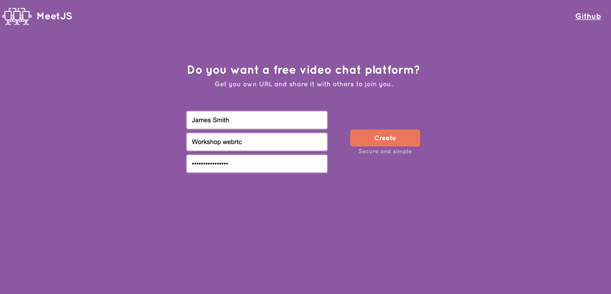
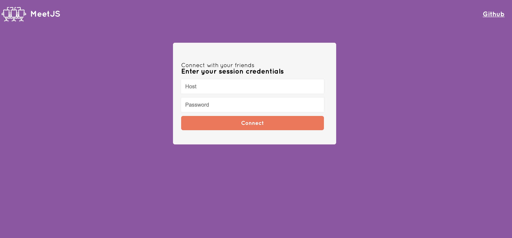
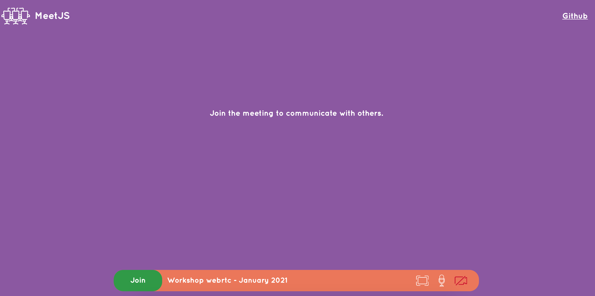

Live Demo - [Open](https://meetjs.netlify.app/)
# MeetJS - A free video chat platform

Application for non-commercial use.
Project created be part of my open-source series. Hope it can help other developers out there trying to develop similar applications.

## WebRTC Architecture

Published an article on Medium's largest active publication (The Startup) - [Read more](https://medium.com/swlh/manage-dynamic-multi-peer-connections-in-webrtc-3ff4e10f75b7).

## Technologies

* React Hooks
* React Router
* Sass (BEM methodology)
* Golang + Gin
* Gorilla Websockets
* MongoDB

## Backend Architecture

When a user creates a session he'll receive a unique hashed URL whereas he can share with others to join the meeting (upon credentials are validated).

## Examples

## Contributing
Pull requests are welcome. For major changes, please open an issue first to discuss what you would like to change.

## License
[MIT](https://choosealicense.com/licenses/mit/)
